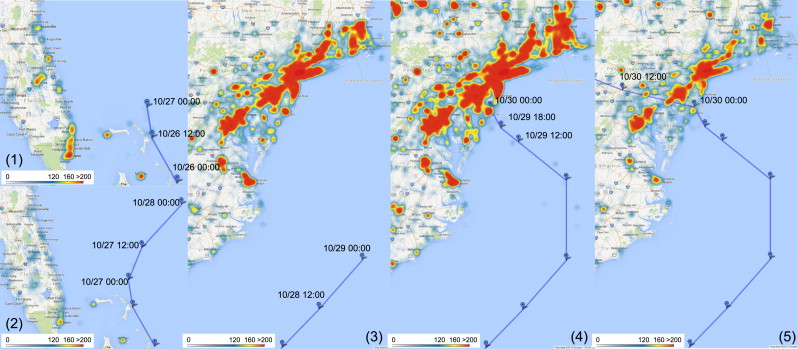
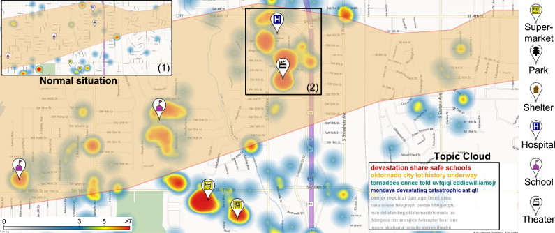
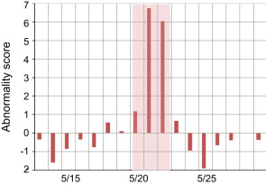
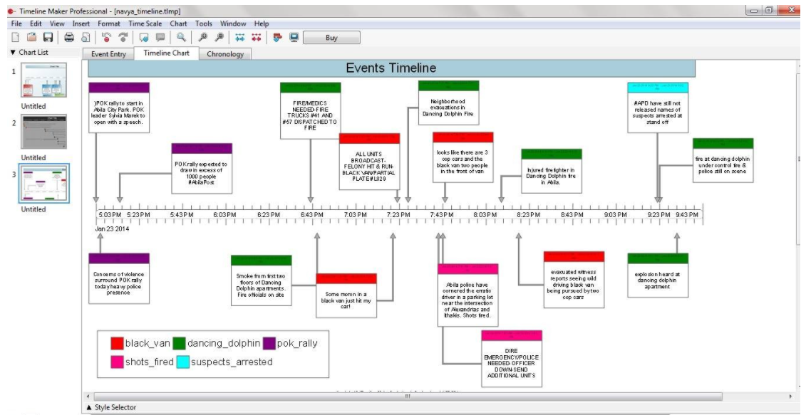
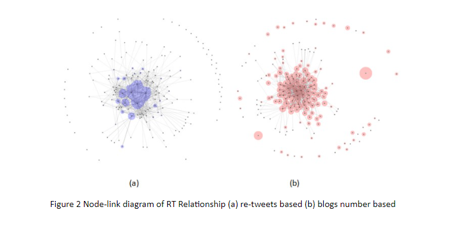
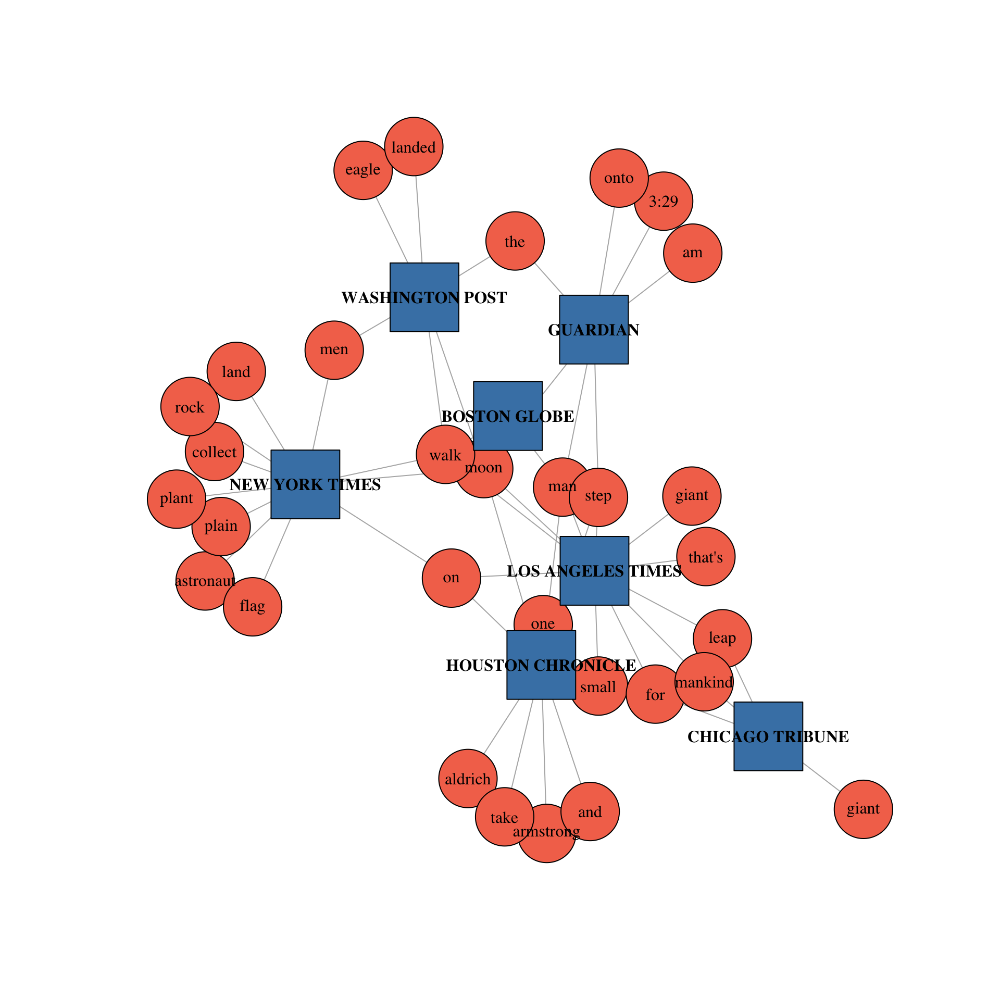
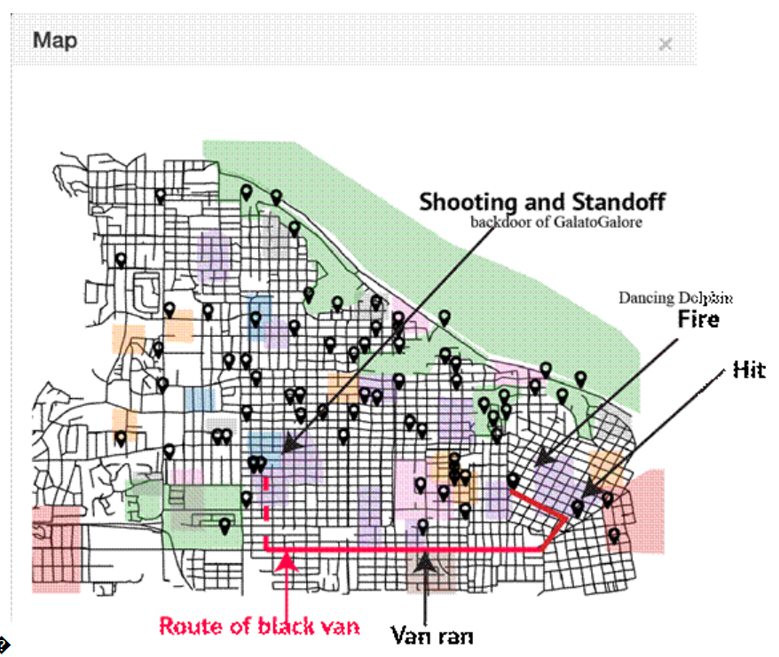
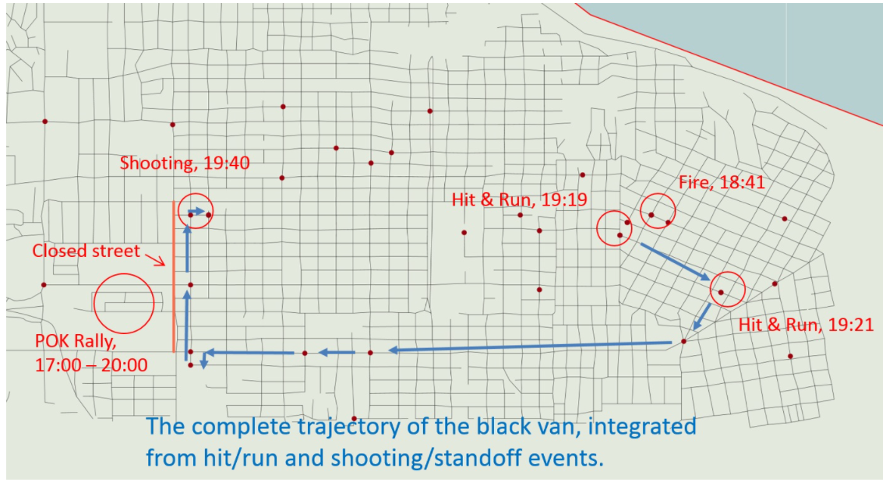
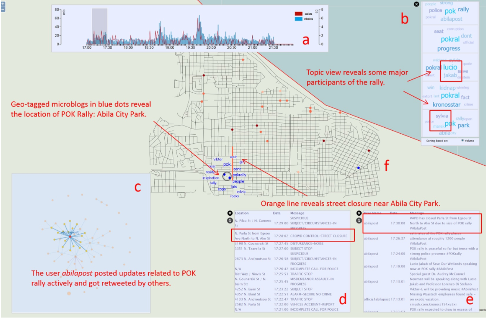

Detecting abnormal events ,such as disaster or crisis, from microblog social media has become a trend, as social media has played a pervasive role in the way people behave and think. Nowadays, people are also using time-stamped , geo -located data to share live information about what's happening in their surroundings, which enables the public, government and researches to sense abnormal events in community more quickly and take immediate actions.

## 2.1 Spatiotemporal Abnormal Detection
The study from Junghoon et al. (2014) applied spatiotemporal visualization of microblog data to detect disaster and support decisions. The visualization they applied are shown as below,



The number of Twitter users who posted Twitter messages containing one of the following keywords: hurricane, storm, and sandy is highly related to Hurricane Sandy (as shown in blue pins and blue lines of the center locations)

Then their study also analyzed spatial pattern of Twitter users after the tornado.



(1)the heatmap shows a normal situation of Twitter user distribution in the same area of which the distribution is very different from the situation after the tornado event. As such, the spatial analytics can help with post disaster management according to twitter heatmap distribution, for example, the authority can allocate more resources to the most visited places by the public

Besides, the abnormality score are calculated with Latent Dirichlet Allocation (LDA) topic modeling and Seasonal-Trend Decomposition to detect severe weather condition.

{width=50%}


The visualization techniques provided very good intuition on visualize location-stamped micro-blog posting to help track disaster status and post disaster management with the different geospatial granularity levels and real-time streaming data states. This is a good inspiration in leveraging on spatiotemporal analysis, LDA modeling and abnormality detection methodology to detect the crisis in the challenge question. 

## 2.2 Event timeline visualization

The submission by [International Institute of Information and Technology](http://visualdata.wustl.edu/varepository/VAST%20Challenge%202014/challenges/MC3%20-%20Real-Time,%20Streaming%20Social%20Media/entries/International%20Institute%20of%20Information%20and%20Technology%20-%20Hyderabad/) has plotted all the sub-events taken and the evidence to describe the timeline of the event.



This summary chart helps audience to get a quick and clear overview of major event happened in Abila, which is a good review of challenge question 1. In R package, we can apply  [timevis](https://github.com/daattali/timevis) pacakge to achieve the function, which enables rich and fully interactive timeline visualizations.


## 2.3 Junk/Spam Detection

In [Visual Analytics Benchmark Repository 2014](http://visualdata.wustl.edu/varepository/VAST%20Challenge%202014/challenges/MC3%20-%20Real-Time,%20Streaming%20Social%20Media/), the submission from [Tianjin University](http://visualdata.wustl.edu/varepository/VAST%20Challenge%202014/challenges/MC3%20-%20Real-Time,%20Streaming%20Social%20Media/entries/Tianjin%20University/) demonstrated a network approach in identifying junk tweet.


They think "the size of the nodes represents the number of the blog being post. Notice that there are several nodes which have the larger size but no relationship with others which means theirs blogs are ignored by others.". 

This is a very good intuition to visualize center and edges microblog users. In addition, I think this visualization can be further improved with visnetwork interactivity, that users can click the node and get more information about the nodes (authors,post,number of retweets and so on.)

## 2.4 Relationship or text and text entities visualization

[Textnets](https://github.com/cbail/textnets) is a R package for automated text analysis using network techniques.It provides network for both text and text entities, which provides visualization ability to uncover correlation of texts in documents.

 { width=70% }

This visualization can be applied in the question 2 in answering the potential consequences of the situation and the number of people who could be affected via network graph.

## 2.5 GeoVisual Analysis

Several benchmark teams in 2014 had insightful geovisual analytics with microblog text analytics,

For example, for submission from [Peking University](http://visualdata.wustl.edu/varepository/VAST%20Challenge%202014/challenges/MC3%20-%20Real-Time,%20Streaming%20Social%20Media/entries/Peking%20University/), they pointed the location of major events shooting/standoff, fire and hit as well as possible route of black van; for submission from [Purdue University](http://visualdata.wustl.edu/varepository/VAST%20Challenge%202014/challenges/MC3%20-%20Real-Time,%20Streaming%20Social%20Media/entries/Purdue%20University/), they analyzed the complete trajectory of black van from shooting and hit/run events.




With understanding of microblog posting for detailed location, we can review and investigate the kidnap event and find possible locations of suspects. These are good approaches for retrospective investigation. While for real time response, we can try to be more flexible to detect the abnormality in microblogs in time with appropriate text mining techniques.

## 2.6 Combination of Geographical and Text Visualization 


It is also worth mentioning one of a innovated combination visualization from [Purdue University](http://visualdata.wustl.edu/varepository/VAST%20Challenge%202014/challenges/MC3%20-%20Real-Time,%20Streaming%20Social%20Media/entries/Purdue%20University/).


As highliged in the example as above, a)temporal pattern of the microblog posting from different sources are tracked properly, b) word cloud of the most frequent words provided information of popular words/topics discussed, C) network graph provides the key opinion leader and its impact to the public, d) and e) detailed microblog posted by ccdata and mbdata, besides, they highlighed the geo location of the events and streets mentioned by call center.
 
This visualization is a very good inspiration on how a live tweets can be tracked and visualized with single data set. The analytics has applied various feature engineering techniques for numerical variables, text mining and network relationships. The fruitful and dynamic information from this single combination graph can really help audience to understand the overall situation and make quick decisions or responses to the event.


```{.r .distill-force-highlighting-css}
```
